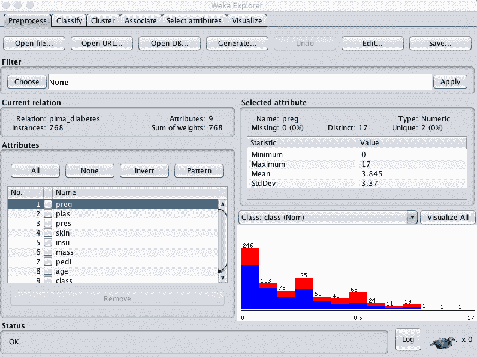
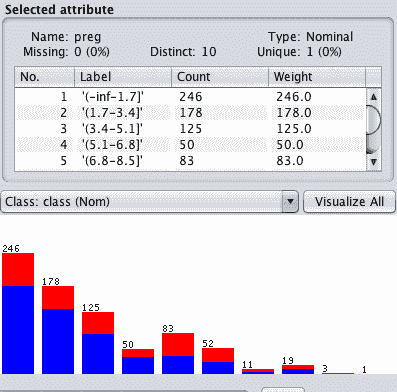
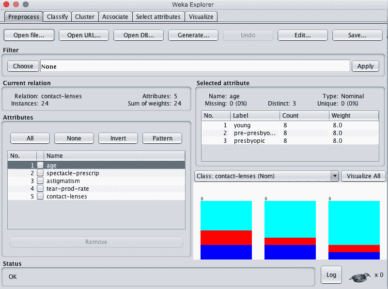
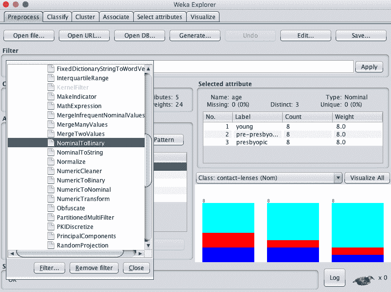
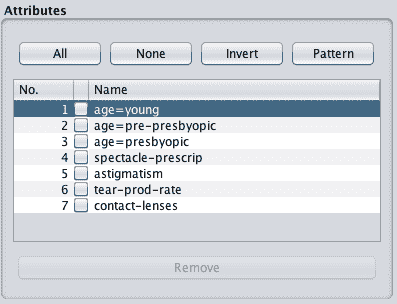

# 如何在 Weka 中转换你的机器学习数据

> 原文：<https://machinelearningmastery.com/transform-machine-learning-data-weka/>

最后更新于 2019 年 12 月 13 日

通常，机器学习的原始数据并不是建模的理想形式。

你需要准备或重塑它，以满足不同机器学习算法的期望。

在这篇文章中，你将发现两种技术，你可以用来转换你的机器学习数据，为建模做准备。

看完这篇文章你会知道:

*   如何将实值属性转换成离散分布称为离散化？
*   如何将一个离散属性转换成多个实值，称为虚拟变量。
*   何时根据数据离散化或创建虚拟变量。

**用我的新书[用 Weka](https://machinelearningmastery.com/machine-learning-mastery-weka/) 启动你的项目**，包括*的分步教程*和清晰的*截图*所有示例。

我们开始吧。

*   **2018 年 3 月更新**:增加了下载数据集的替代链接，因为原件似乎已经被取下来。

## 离散化数值属性

一些机器学习算法更喜欢或发现处理离散属性更容易。

例如，决策树算法可以选择实值属性中的分割点，但是当分割点在实值属性中的面元或预定义组之间选择时，它会更加清晰。

离散属性是描述一个类别的属性，称为名义属性。那些描述一个类别的属性被称为序数属性，在这个类别的顺序中有一个意义。将实值属性转换为序数属性或箱的过程称为离散化。

您可以使用离散化过滤器在 Weka 中离散化您的实值属性。

下面的教程演示了如何使用离散化过滤器。皮马印第安人糖尿病发病数据集用于演示该过滤器，因为输入值是实值的，将它们分组到箱中可能有意义。

您可以在此了解有关数据集的更多信息:

*   [数据集文件](https://raw.githubusercontent.com/jbrownlee/Datasets/master/pima-indians-diabetes.csv)。
*   [数据集详细信息](https://raw.githubusercontent.com/jbrownlee/Datasets/master/pima-indians-diabetes.names)

您也可以通过加载文件 *diabetes.arff* ，在 *data/* 目录下访问您的 Weka 安装中的数据集目录。

1.打开Weka浏览器。

2.加载皮马印第安人糖尿病发病数据集。

Weka浏览器加载的糖尿病数据集

3.单击过滤器的“选择”按钮，并选择“离散化”，它位于“无监督.属性.离散化”下

Weka选择离散化数据过滤器

4.单击过滤器进行配置。您可以选择要离散化的属性的索引，默认情况下是离散化所有属性，这就是我们在这种情况下要做的。点击“确定”按钮。

5.单击“应用”按钮应用过滤器。

您可以单击每个属性并查看“选定属性”窗口中的详细信息，以确认过滤器已成功应用。

Weka离散化属性

[离散化](https://en.wikipedia.org/wiki/Discretization_of_continuous_features)当使用决策树类型算法时，您的实值属性最有用。当你相信在给定的属性值中有自然的分组时，这可能更有用。

## 将名义属性转换为虚拟变量

一些机器学习算法更喜欢使用实值输入，不支持名义或序数属性。

名义属性可以转换为真实值。这是通过为每个类别创建一个新的二进制属性来实现的。对于具有该值类别的给定实例，二进制属性设置为 1，其他类别的二进制属性设置为 0。这个过程叫做创建虚拟变量。

您可以使用 NominalToBinary 过滤器从 Weka 中的名义属性创建虚拟二进制变量。

下面的配方演示了如何使用 NominalToBinary 过滤器。隐形眼镜数据集被用来演示这个过滤器，因为属性都是名义上的，并为创建虚拟变量提供了大量的机会。

您可以从 [UCI 机器学习资源库](https://archive.ics.uci.edu/ml/datasets/Lenses)下载隐形眼镜数据集。您也可以通过加载文件*隐形眼镜，在*数据/* 目录下访问您的 Weka 安装中的数据集目录。*

1.打开Weka浏览器。

2.加载隐形眼镜数据集。

Weka 浏览器加载的隐形眼镜数据集

3.单击过滤器的“选择”按钮，并选择“无监督”

Weka 选择通用数据过滤器

4.单击过滤器进行配置。您可以选择要转换为二进制值的属性的索引，默认情况下是转换所有属性。将其更改为仅第一个属性。点击“确定”按钮。

Weka 通用数据过滤器配置

5.单击“应用”按钮应用过滤器。

查看属性列表将显示年龄属性已被移除，并被三个新的二进制属性替换:年龄=年轻、年龄=老视前和年龄=老视。

weka 名义属性转换为汇总变量

[创建虚拟变量](https://en.wikipedia.org/wiki/Dummy_variable_(statistics))对于不支持名义输入变量的技术很有用，如线性回归和逻辑回归。它在 k 近邻和人工神经网络等技术中也被证明是有用的。

## 摘要

在这篇文章中，您发现了如何转换您的机器学习数据，以满足不同机器学习算法的期望。

具体来说，您了解到:

*   如何将实值输入属性转换为名义属性称为离散化。
*   如何将一个分类输入变量转换成多个称为虚拟变量的二进制输入属性。
*   建模数据时何时使用离散化和虚拟变量。

你对数据转换或这篇文章有什么问题吗？在评论中提出你的问题，我会尽力回答。