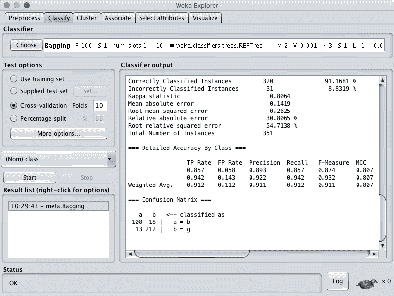
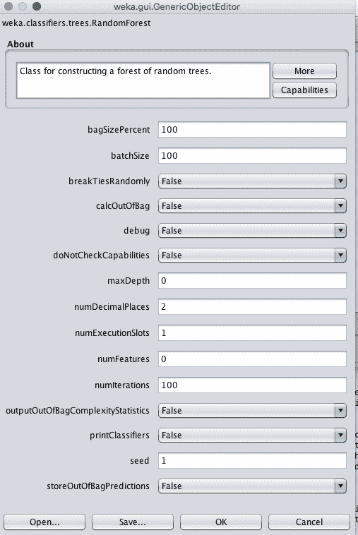
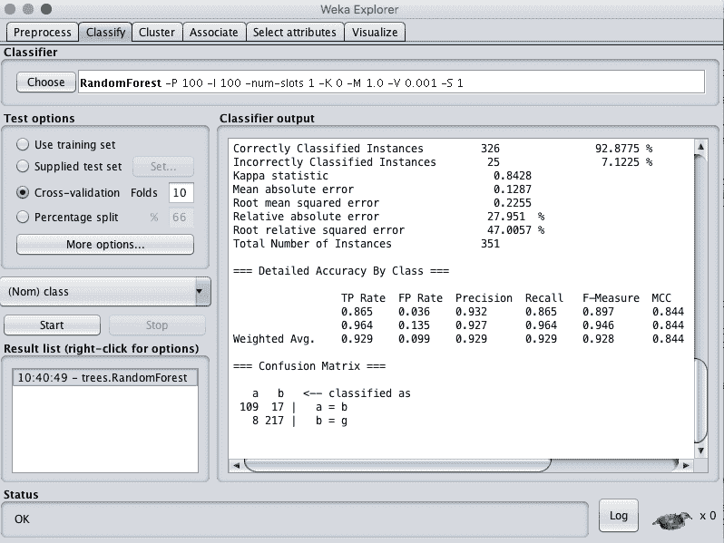
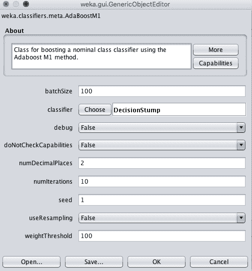
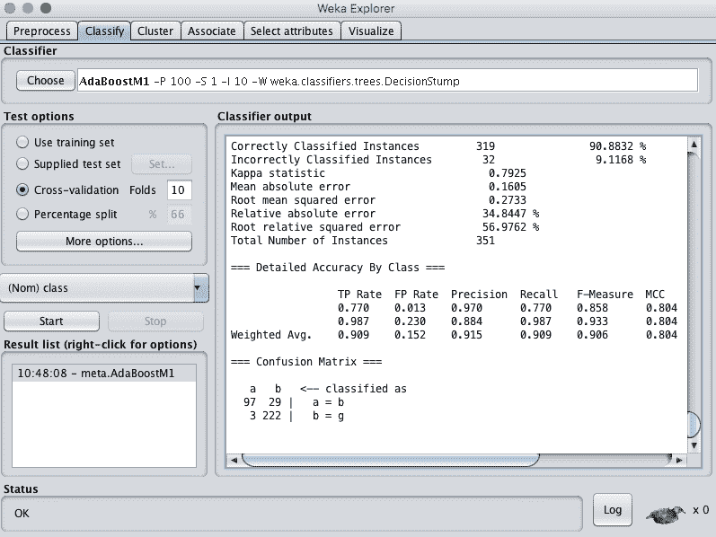
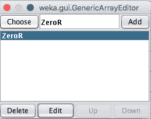

# 如何在 Weka 中使用集成机器学习算法

> 原文：<https://machinelearningmastery.com/use-ensemble-machine-learning-algorithms-weka/>

最后更新于 2019 年 8 月 22 日

[集成算法](https://machinelearningmastery.com/ensemble-methods-for-deep-learning-neural-networks/)是一类强大的机器学习算法，它结合了来自多个模型的预测。

使用 Weka 进行应用机器学习的一个好处是，可以使用这么多不同的集成机器学习算法。

在这篇文章中，你将发现如何在 Weka 中使用集成机器学习算法。

看完这篇文章你会知道:

*   大约 5 种顶级集成机器学习算法。
*   如何在 Weka 中使用顶级集成算法？
*   关于 Weka 中集成算法的关键配置参数。

**用我的新书[用 Weka](https://machinelearningmastery.com/machine-learning-mastery-weka/) 启动你的项目**，包括*的分步教程*和清晰的*截图*所有示例。

我们开始吧。

如何在 Weka
中使用集成机器学习算法。

## 集成算法综述

我们将带您参观 Weka 的 5 种顶级集成机器学习算法。

我们介绍的每种算法都将根据其工作原理进行简要描述，关键算法参数将突出显示，算法将在 Weka Explorer 界面中演示。

我们将回顾的 5 种算法是:

1.  制袋材料
2.  随机森林
3.  adaboost 算法
4.  投票
5.  堆垛

这是 5 个算法，你可以在你的问题上尝试，以提高表现。

一个标准的机器学习分类问题将被用来演示每个算法。

具体来说，电离层二分类问题。这是一个很好的数据集来演示分类算法，因为输入变量是数字，并且都有相同的规模，问题只有两个类别可以区分。

每个例子都描述了来自大气层的雷达回波的特性，任务是预测电离层中是否有结构。有 34 个数值输入变量，通常具有相同的规模。您可以在 [UCI 机器学习资源库](https://archive.ics.uci.edu/ml/datasets/Ionosphere)上了解更多关于该数据集的信息。最高的结果大约是 98%的准确率。

启动Weka浏览器:

1.  打开Weka图形用户界面选择器。
2.  单击“浏览器”按钮打开Weka浏览器。
3.  从*数据/电离层. arff* 文件加载电离层数据集
4.  单击“分类”打开“分类”选项卡。

## 引导聚合(装袋)

Bootstrap Aggregation(简称 Bagging)是一种集成算法，可用于分类或回归。

Bootstrap 是一种统计估计技术，其中像均值这样的统计量是从数据的多个随机样本中估计出来的(带有替换)。当您拥有有限的数据量，并且对统计量的更可靠估计感兴趣时，这是一种有用的技术。

这个样本原理可以用于机器学习模型。您的训练数据的多个随机样本被替换绘制，并用于训练多个不同的机器学习模型。然后使用每个模型进行预测，并对结果进行平均以给出更稳健的预测。

这种技术最适合用于低偏差和高方差的模型，这意味着它们所做的预测高度依赖于训练它们的特定数据。最常用的符合高方差要求的装袋算法是决策树。

选择装袋算法:

1.  点击“选择”按钮，选择“元”组下的“装袋”。
2.  单击算法名称查看算法配置。

装袋算法的 Weka 配置

装袋中的一个关键配置参数是被装袋的模型类型。默认值是 REPTree，它是标准决策树的 Weka 实现，也称为分类和回归树或简称 CART。这是在分类器参数中指定的。

每个随机样本的大小在 bagSizePercent 中指定，bagSizePercent 是原始训练数据集的百分比大小。默认值为 100%，这将创建一个与训练数据集大小相同的新随机样本，但组成不同。

这是因为随机样本是用替换绘制的，这意味着每次从训练数据集中随机绘制一个实例并添加到样本中时，它也会被添加回训练数据集中(替换)，这意味着它可以被再次选择并添加两次或更多次到样本中。

最后，袋子的数量(和分类器的数量)可以在 numIterations 参数中指定。默认值为 10，尽管通常使用数百或数千的值。继续增加数字操作的价值，直到您不再看到模型的改进，或者内存耗尽。

1.  单击“确定”关闭算法配置。
2.  单击“开始”按钮，在电离层数据集上运行算法。

可以看到，在默认配置下，装袋的准确率达到了 91%。

Bagging 算法的 Weka 分类结果

## 随机森林

随机森林是决策树装袋的扩展，可用于分类或回归。

袋装决策树的缺点是，决策树是使用贪婪算法构建的，该算法在树构建过程的每一步选择最佳分割点。因此，最终得到的树看起来非常相似，这减少了来自所有包的预测的方差，这反过来又损害了所做预测的稳健性。

随机森林是对袋装决策树的改进，它在树创建期间中断了贪婪分割算法，因此分割点只能从输入属性的随机子集中选择。这种简单的改变会大大降低袋装树之间的相似性，进而降低预测结果。

选择随机森林算法:

1.  单击“选择”按钮，选择“树”组下的“随机森林”。
2.  单击算法名称查看算法配置。

随机森林算法的Weka配置

除了上面列出的装袋参数之外，随机森林的一个关键参数是每个分割点中要考虑的属性数量。在 Weka 中，这可以由 numFeatures 属性控制，该属性默认设置为 0，根据经验规则自动选择值。

1.  单击“确定”关闭算法配置。
2.  单击“开始”按钮，在电离层数据集上运行算法。

可以看到，在默认配置下，随机森林的准确率达到 92%。

随机森林算法的Weka分类结果

## adaboost 算法

AdaBoost 是一种用于分类问题的集成机器学习算法。

它是一组称为 boosting 的集成方法的一部分，该方法在一系列模型中添加新的机器学习模型，后续模型试图修复先前模型产生的预测误差。AdaBoost 是这类模型的第一个成功实现。

Adaboost 被设计成使用短决策树模型，每个模型有一个决策点。这种矮树通常被称为决策树桩。

第一个模型是按常规构造的。对训练数据集中的每个实例进行加权，并根据模型的整体准确率以及实例分类是否正确来更新权重。随后的模型被训练和添加，直到达到最低准确率或不可能进一步改进。每个模型都根据其技能进行加权，这些权重在结合所有模型对新数据的预测时使用。

选择 AdaBoost 算法:

1.  点击“选择”按钮，选择“元”组下的“AdaBoostM1”。
2.  单击算法名称查看算法配置。

AdaBoost 算法的 Weka 配置

AdaBoost 模型中的弱学习器可以由分类器参数指定。

默认值是决策树桩算法，但也可以使用其他算法。除了弱学习器之外，一个关键参数是要创建和添加的系列模型的数量。这可以在 numIterations 参数中指定，默认值为 10。

1.  单击“确定”关闭算法配置。
2.  单击“开始”按钮，在电离层数据集上运行算法。

您可以看到，在默认配置下，AdaBoost 实现了 90%的准确率。

AdaBoost 算法的 Weka 分类结果

## 投票

投票可能是最简单的集成算法，并且通常非常有效。它可以用于分类或回归问题。

投票通过创建两个或多个子模型来工作。每个子模型进行预测，这些预测以某种方式组合在一起，例如采用预测的平均值或模式，允许每个子模型对结果进行投票。

选择投票算法:

1.  点击“选择”按钮，选择“元”组下的“投票”。
2.  单击算法名称查看算法配置。

投票集成算法的Weka配置

投票集成的关键参数是子模型的选择。

模型可以在分类器参数的 Weka 中指定。单击此参数可以添加多个分类器。

投票集成算法的Weka算法选择

选择分类器后，单击“编辑”按钮，即可配置该分类器的详细信息。选择子模型的目的是选择做出完全不同预测(不相关预测)的模型。因此，选择非常不同的模型类型是一个很好的经验法则，比如树、基于实例的方法、函数等等。

为投票配置的另一个关键参数是如何组合子模型的预测。这由 combinationRule 参数控制，默认情况下，该参数设置为取概率的平均值。

1.  单击“确定”关闭算法配置。
2.  单击“开始”按钮，在电离层数据集上运行算法。

您可以看到，在默认配置下，投票的准确率为 64%。

显然，这种技术效果不佳，因为只选择了 ZeroR 子模型。尝试选择 5 到 10 个不同的子模型。

## 堆叠概括(堆叠)

[堆叠泛化或堆叠](https://machinelearningmastery.com/stacking-ensemble-for-deep-learning-neural-networks/)简称是投票集成的简单扩展，可用于分类和回归问题。

除了选择多个子模型之外，堆叠还允许您指定另一个模型，以了解如何最好地组合子模型中的预测。因为元模型用于最好地组合子模型的预测，所以这种技术有时被称为混合，就像将预测混合在一起一样。

选择堆叠算法:

1.  单击“选择”按钮，选择“元”组下的“堆叠”。
2.  单击算法名称查看算法配置。

堆叠集成算法的Weka配置

与投票分类器一样，您可以在分类器参数中指定子模型。

将被训练来学习如何最好地组合来自子模型的预测的模型可以在元分类器参数中指定，默认情况下，该参数被设置为零(多数票或平均值)。对于回归和分类类型问题，通常分别使用线性算法，如线性回归或逻辑回归。这是为了获得子模型预测的简单线性组合的输出。

1.  单击“确定”关闭算法配置。
2.  单击“开始”按钮，在电离层数据集上运行算法。

您可以看到，在默认配置下，堆叠的准确率为 64%。

同样，与投票相同，Stacking 取得的结果很差，因为只选择了 ZeroR 子模型。尝试选择 5 到 10 个不同的子模型和一个好的模型来组合预测。

叠加集成算法的Weka分类结果

## 摘要

在这篇文章中，你发现了如何在 Weka 中使用集成机器学习算法。

具体来说，您了解到:

*   大约 5 个集成机器学习算法，你可以用在你的问题上。
*   如何在 Weka 中使用集成机器学习算法？
*   关于 Weka 中集成机器学习算法的关键配置参数。

你对 Weka 中的集成机器学习算法或者这个帖子有什么疑问吗？在评论中提问，我会尽力回答。